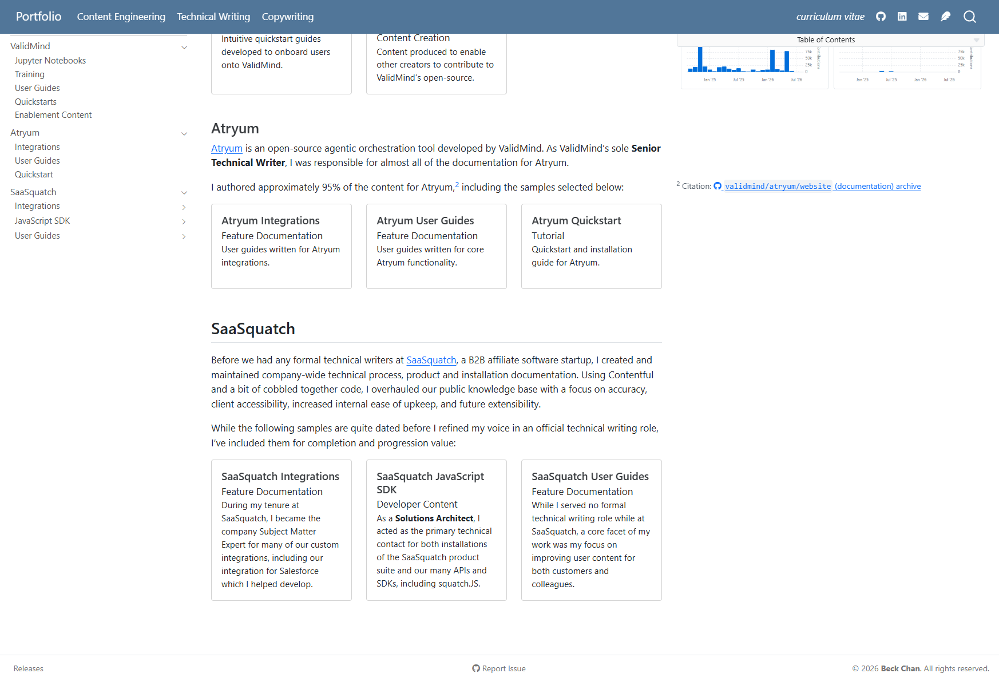
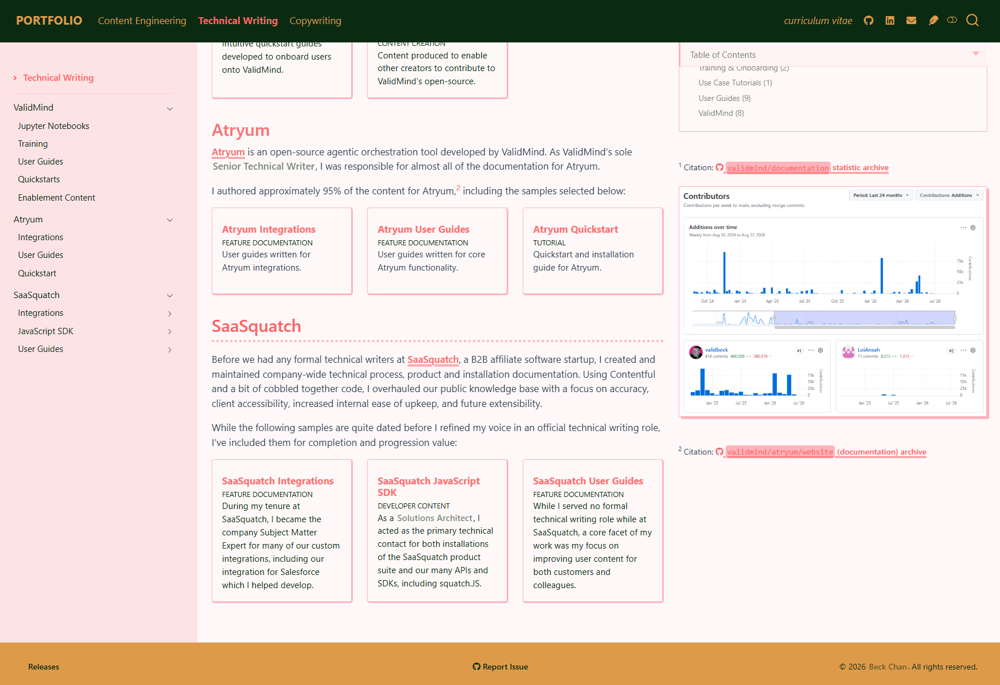
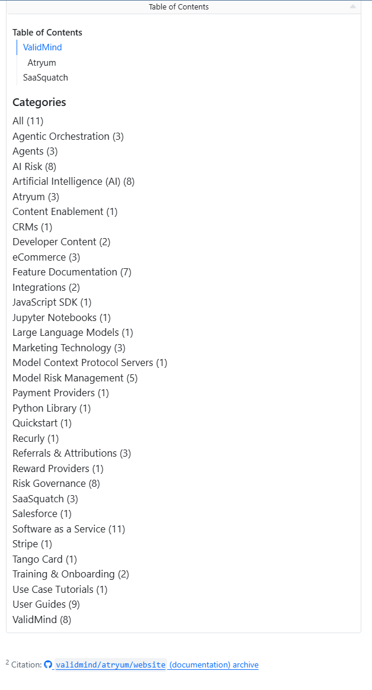
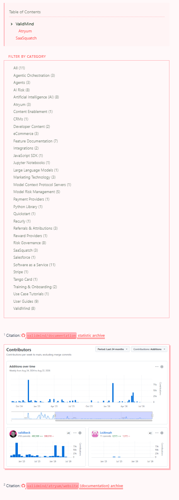
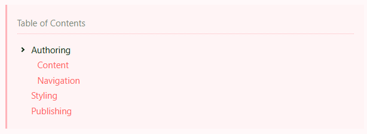
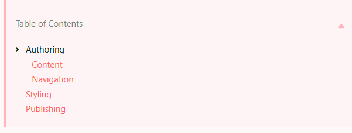

::: {.hidden}
This static portfolio site is built using Quarto, styled with custom Bootstrap themes, and deployed by GitHub Workflows.

:::

This static portfolio site is built using Quarto,^[[Quarto](https://quarto.org/){target="_blank"}] styled with custom Bootstrap themes,^[[Bootstrap](https://getbootstrap.com/){target="_blank"}] and deployed with GitHub Workflows.^[**GitHub:**[Workflows](https://docs.github.com/en/actions/concepts/workflows-and-actions/workflows){target="_blank"}]

## Authoring

I choose Quarto because Quarto is extensible, but simple to use.

::: {.callout-tip collapse="true"}
## What is Quarto?

Quarto is not a traditional Content Management System (CMS), but an open-source publication framework. 

From your variety of source files, Quarto can build file formats such as `.html` or `.pdf`, and can natively run code within your content in languages such as Python or R to include live outputs.

:::

### Content

::: {.panel-tabset}

#### Independent Pages

Portfolio content is written in `.qmd` files, Quarto's version of Markdown where you specify metadata in a YAML frontmatter block.

For example:

```markdown
---
title: "Portfolio"
subtitle: "Content Engineering"
categories: ["Content Architecture", "Quarto", "GitHub Pages", "Netlify", "CI/CD Workflows", "Frontend Development"]
---

How [https://beck-chan.github.io/](https://beck-chan.github.io/) is built and maintained.
```

#### Single-Sourced Content

Content that is repeated can be single-sourced from Quarto Includes^[**Quarto:** [Includes](https://quarto.org/docs/authoring/includes.html){target="_blank"}] `_*.qmd` files, allowing for updates to shared content across multiple pages without having to manually update each page. 

For example, my introduction for one of the organizations I've worked with, ValidMind ...

```markdown

```

... renders as the below snippet everywhere it's embedded:



#### Searching Content

Quarto offers built-in indexing and searching capabilities,^[**Quarto:** [Website Search](https://quarto.org/docs/websites/website-search.html){target="_blank"}] placed in the top navigation via an independent top-level frontmatter file called `_quarto.yml`:

```yaml
  search:
    location: navbar
```

I've also written a quick script to embed the same search within a page's content itself for ease of access:^[** beck-chan/portfolio/assets: **[search.html](https://github.com/beck-chan/portfolio/blob/main/assets/search.html){target="_blank"}]

::: {.tc}

```{=html}
<div class="inline-quarto-search">
<button
    type="button"
    class="inline-quarto-search__trigger"
    id="open-quarto-search"
    aria-haspopup="dialog"
    aria-controls="quarto-search"
>
    <i class="fa-solid fa-magnifying-glass" aria-hidden="true"></i>
    <span class="inline-quarto-search__label">Search Portfolio</span>
    <kbd class="inline-quarto-search__hint">/</kbd>
</button>
</div>
<script>
(() => {
    const openQuartoSearch = () => {
    const detached = document.querySelector(
        "#quarto-search .aa-DetachedSearchButton"
    );
    if (detached) {
        detached.click();
        return;
    }
    document.querySelector("#quarto-search input.aa-Input")?.focus();
    };

    document.addEventListener("DOMContentLoaded", () => {
    document
        .getElementById("open-quarto-search")
        ?.addEventListener("click", openQuartoSearch);
    });
})();
</script>
```

:::


:::

### Navigation

Filepaths are defined by directory structure, and then link display specified in the top or side navigation bars via `_*.yml` files.

::: {.panel-tabset}

#### Top Navigation

The consistent top navigation bar is defined in the root directory with our top-level `_quarto.yml`:

```{.yaml shortcodes=false}
# Include the independent directory _sidebar.yaml files to display the correct sidenavs 
metadata-files:
  - samples/content-engineering/_sidebar.yaml
  - samples/technical-writing/_sidebar.yaml
  - samples/copywriting/_sidebar.yaml

# Define the top navigation bar
website:
  title: "Portfolio"
  favicon: assets/headshot.png
  page-navigation: true
  navbar:
    left:
      - samples/content-engineering/index.qmd
      - samples/technical-writing/index.qmd
      - samples/copywriting/index.qmd
    right:
      - cv.qmd
      - text: '[]{title="GitHub / beck-chan"}'
        target: _blank
        href: https://github.com/beck-chan
        aria-label: GitHub
      - text: '[]{title="LinkedIn / beck-chan"}'
        target: _blank
        href: https://linkedin.com/in/beck-chan
        aria-label: LinkedIn
      - text: '[]{title="Email / beckchan.tech@gmail.com"}'
        href: mailto:beckchan.tech@gmail.com
        target: _blank
        aria-label: Email
      - text: '[]{title="Poetry"}'
        href: poetry/index.qmd
        aria-label: Poetry
```

#### Sidebars

Each external facing directory has its own `_sidebar.yml` and `_metadata.yml` files that defines the sidebar navigation for that directory. 

For the `content-engineering/` directory, the contents of those two files are:

```yaml
# _sidebar.yaml
website:
  sidebar:
    - id: content
      title: "Content Engineering"
      contents:
        - text: "Content Engineering"
          file: samples/content-engineering/index.qmd
        - text: "---"
        - section: "ValidMind"
          href: samples/content-engineering/validmind/index.qmd
          contents:
            - text: "Developer Library"
              file: samples/content-engineering/validmind/library.qmd
            - text: "Training"
              file: samples/content-engineering/validmind/academy.qmd
            - text: "Release Notes"
              file: samples/content-engineering/validmind/releases.qmd
            - text: "Quickstarts"
              file: samples/content-engineering/validmind/quickstarts.qmd
            - text: "Documentation Redesign"
              file: samples/content-engineering/validmind/redesign.qmd

        #  And all the rest...
```

```yaml
# _metadata.yml
format:
  html:
    sidebar: content
```

#### Footer

Similarly, the footer is also defined in `_quarto.yml`:

```{.yaml shortcodes=false}
  page-footer:
    left:
      - text: "Releases"
        href: https://github.com/beck-chan/portfolio/releases
        target: _blank
    center:
      - text: " Report Issue"
        href: https://github.com/beck-chan/portfolio/issues
        target: _blank
    right:
      - text: "&#169; 2026 <b>Beck Chan</b>. All rights reserved."
```

:::

## Styling

Quarto offers a few built-in themes, but I chose define custom themes using Bootstrap (`.scss`).

### Core Theming

Themes are defined in the root directory with our top-level `_quarto.yml`:

```yaml
    theme:
    # default theme
      light: assets/themes/default/styles.scss
    # monochrome theme
      dark: assets/themes/minimal/styles.scss
    syntax-highlighting:
    # default theme
      light: assets/themes/default/code.theme
    # muted theme
      dark: assets/themes/minimal/code.theme
```

For reference, this is how the portfolio looks without my custom themes applied:^[[View Unstyled Portfolio](https://beckchan-folio.netlify.app/){target="_blank" .button}]

::: {.iframe url="https://beckchan-folio.netlify.app/" title="Unstyled Portfolio" width="90%" height=660}
:::

::: {.panel-tabset}

#### Full Colour Theme

Default theme users see when they load the portfolio. Defined in `assets/themes/default/styles.scss`:^[** beck-chan/portfolio/assets:** [styles.scss](https://github.com/beck-chan/portfolio/blob/main/assets/themes/default/styles.scss){target="_blank"}]

```scss
/*-- scss:defaults --*/

// Foundations
$body-bg: #fff8f9; // Page colour
$body-color: #0b2a12; // Font colour
$navbar-bg: #0b2a12; // Top nav bg colour
$sidebar-bg: #fee3e5; // Side nav bg colour
$navbar-padding-y: 1rem; // Top nav padding
$sidebar-padding-y: 1rem; // Top nav padding
$footer-bg: #df9a49; // Footer bg

// And so on


/*-- scss:rules --*/

/* Import modular SCSS files */
@import '_styles/links';
@import '_styles/nav';
@import '_styles/content';
@import '_styles/margin';
@import '_styles/mobile';
```

And code styling is defined in `assets/themes/default/code.theme`:^[** beck-chan/portfolio/assets:** [code.theme](https://github.com/beck-chan/portfolio/blob/main/assets/themes/default/code.theme){target="_blank"}]

```json
{
  "text-color": "#df9a49",
  "background-color": "#0b2a12",
  "line-number-color": "#4a5d4e",
  "text-styles": {
    "Normal": { "text-color": "#df9a49" },
    "Variable": { "text-color": "#df9a49" },
    "Other": { "text-color": "#e8b06a" },

    // And so on ...

  }
}
```

#### Monochrome Theme

You can toggle this theme in the top navigation bar by clicking ****. Defined in `assets/themes/minimal/styles.scss`:^[** beck-chan/portfolio/assets: **[styles.scss](https://github.com/beck-chan/portfolio/blob/main/assets/themes/minimal/styles.scss){target="_blank"}]

```scss
/*-- scss:defaults --*/

// Foundations
$body-bg: #FFFFFF; // Page colour
$body-color: #212121; // Font colour
$navbar-bg: #000000; // Top nav bg colour
$sidebar-bg: #e9e9e9; // Side nav bg colour
$navbar-padding-y: 1rem; // Top nav padding
$sidebar-padding-y: 1rem; // Top nav padding

// And so on


/*-- scss:rules --*/

/* Import modular SCSS files */
@import '_styles/links-min';
@import '_styles/nav-min';
@import '_styles/content-min';
@import '_styles/margin-min';
@import '_styles/mobile-min';
```

And code styling is defined in `assets/themes/minimal/code.theme`:^[** beck-chan/portfolio/assets:** [code.theme](https://github.com/beck-chan/portfolio/blob/main/assets/themes/minimal/code.theme){target="_blank"}]

```json
{
  "text-color": "#c2a077",
  "background-color": "#212121",
  "line-number-color": "#505952",
  "text-styles": {
    "Normal": { "text-color": "#c2a077" },
    "Variable": { "text-color": "#c2a077" },
    "Other": { "text-color": "#d0b491" },

    // And so on ...
  }
}
```

:::

### Custom Adjustments

There's a limit to what you can adjust with CSS due to Quarto's quirks, so I have some additional custom script adjustments set in `_quarto.yml` under `include-after-body`:

```yaml
    include-after-body:
      - assets/margin-below-toc.html
      - assets/sticky-toc-toggle.html
      - assets/pin-sidenav.html
```

::: {.panel-tabset}

#### Pinned Side Navigation

`assets/pin-sidenav.html`:^[** beck-chan/portfolio/assets:** [pin-sidenav.html](https://github.com/beck-chan/portfolio/blob/main/assets/pin-sidenav.html){target="_blank"}] Patch for Quarto's left sidebar scrolling vertically with the page instead of staying fixed, since CSS alone can't pin the sidebar reliably without breaking the page layout.

:::: {.flex .flex-wrap .justify-around}

::: {.w-50 .pa2}

**Before**

{.pics group="sidebar"}

:::

::: {.w-50 .pa2}

**After**

{.pics group="sidebar"}

:::

::::

#### Margin Below Table of Contents

Footnotes are positioned in the right margin as a matter of personal preference, which means that they can overlap with the table of contents, any category filtering options, and the footer when the margin stacks tall, as well as break tabset containment.

`assets/margin-below-toc.html`:^[** beck-chan/portfolio/assets:** [margin-below-toc.html](https://github.com/beck-chan/portfolio/blob/main/assets/margin-below-toc.html){target="_blank"}]  Cascades notes below the table of contents and category filters, pads the main content area when margin outgrows the body so it doesn't collide with the footer, and hoists footnotes attached to tabset content into a sibling container. 

:::: {.flex .flex-wrap .justify-around}

::: {.w-50 .pa2}

**Before**

{.pics group="margin"}

:::

::: {.w-50 .pa2}

**After**

{.pics group="margin"}

:::

::::

#### Sticky Table of Contents 

`assets/sticky-toc-toggle.html`:^[** beck-chan/portfolio/assets:** [sticky-toc-toggle.html](https://github.com/beck-chan/portfolio/blob/main/assets/sticky-toc-toggle.html){target="_blank"}] Shows a fixed table of contents dropdown when the page scrolls past the inline table of contents, allowing access to the table of contents anywhere on the page.

:::: {.flex .flex-wrap .justify-around}

::: {.w-50 .pa2}

{.pics group="toc"}

:::

::: {.w-50 .pa2}

{.pics group="toc"}

:::

::::


:::

## Extensions

I've also written a couple of Quarto Extensions^[[**Quarto:** [Extensions](https://quarto.org/docs/extensions/){target="_blank"}]] for custom functionality I found myself reusing and wanted to simplify the implementation of.

### Code Folding

### Embedded Iframes


## Publishing

I've chosen to automate the publishing process in the spirit of Continuous Integration and Continuous Delivery and Deployment (CI/CD), letting GitHub Workflows handle both generating (via `quarto render`) the website files from the source `.qmd` files, and deploying the completed site to GitHub Pages and Netlify where my production and staging portfolios are respectively hosted.

### Output

The first thing I did was define the output directory and and how and what files should be rendered in `_quarto.yml`:

```yaml
project:
  type: website
  output-dir: _output # The default is _site
  render:
    - "**/*.qmd"
    - "**/*.ipynb"
```

In my `.gitignore`, I've added the `_output` directory to avoid committing website files to the repository whenever they are generated locally by previewing or testing as I want rendering to actually be done on the fly via GitHub Actions.

::: {.callout}
This prevents me from ever accidentally forgetting to render the updated output files before calling it done, and as a result having outdated files displaying on the live portfolio site. 

:::

### Pull Requests (PRs)

Since the content for this portfolio lives in my GitHub repository,^[[ beck-chan/portfolio](https://github.com/beck-chan/portfolio){target="_blank"}] I've also decided to use pull requests to merge major changes into my `main` branch as part of good version control practices even if I'm the only one working on any changes.

Each PR top-level comment is autopopulated with content from a PR template,^[** beck-chan/portfolio/.github/:** [pull_request_template.md](https://raw.githubusercontent.com/beck-chan/portfolio/refs/heads/main/.github/pull_request_template.md){target="_blank"}] that includes information on how to trigger automated release notes:

```markdown
<!-- Any internal notes go here -->


## Release notes

<!-- 

Tag the PR with one of the following labels so that releases.yaml can automatically generate a GitHub release bump:

1. `major` (example: 1.0.0)
2. `minor` (example: 1.1.0)
3. `patch` (example: 1.1.1)

Tagging with more than one label will give precedence in the order as numbered.

Include any release notes you want displayed under this section.

-->


<!-- Leave below untouched -->

**Browse the updated portfolio at: [https://beck-chan.github.io/](https://beck-chan.github.io/)**
```

Utilizing pull requests allows me to streamline a few additional things with GitHub Workflows and automate (more on the last three in [Portfolio Deployment](deployment.qmd)):

- [x] Spellchecking relevant files as part of PR checks.
- [x] Rendering and deploying the rendered files to Netlify for an open PR to my staging site.
- [x] Generating release notes from PRs tagged with specific labels.
- [x] Rendering and deploying the rendered files to GitHub Pages production site when the PR is merged into `main`.

#### Spellcheck

`.github/workflows/spellcheck.yaml`^[** beck-chan/portfolio/.github/workflows:** [spellcheck.yaml](https://github.com/beck-chan/portfolio/blob/main/.github/workflows/spellcheck.yaml){target="_blank"}] runs when a PR is opened, or when a commit is sent up to a branch connected to a PR, checking for spelling errors in relevant `*.qmd` files and adding a comment with the results when complete:[^spellcheck]

```yaml
        # Set up steps ...

      - name: Run spell checker
        id: spellcheck
        run: |
          set +e
          npx --yes cspell "**/*.qmd" --exclude "_output" --exclude ".quarto" --exclude "poetry/random/*" > cspell-output.txt
          status=$?
          set -e
          cat cspell-output.txt
          echo "exit_code=$status" >> "$GITHUB_OUTPUT"

      - name: Comment on PR
        uses: actions/github-script@v7
        with:
          script: |
            const fs = require('fs');
            const marker = '<!-- cspell-pr-comment -->';
            const failed = '${{ steps.spellcheck.outputs.exit_code }}' !== '0';
            let output = fs.readFileSync('cspell-output.txt', 'utf8').trim();
            const max = 60000;
            if (output.length > max) {
              output = output.slice(0, max) + '\n\n…truncated';
            }

            const body = failed
              ? `${marker}\n## Spelling errors found\n\n\`\`\`text\n${output}\n\`\`\``
              : `${marker}\n## No spelling errors found`;

            const comments = await github.paginate(github.rest.issues.listComments, {
              owner: context.repo.owner,
              repo: context.repo.repo,
              issue_number: context.issue.number,
            });
            const existing = comments.find((c) => c.body?.includes(marker));

            if (existing) {
              await github.rest.issues.updateComment({
                owner: context.repo.owner,
                repo: context.repo.repo,
                comment_id: existing.id,
                body,
              });
            } else {
              await github.rest.issues.createComment({
                owner: context.repo.owner,
                repo: context.repo.repo,
                issue_number: context.issue.number,
                body,
              });
            }
```

Words to be ignored are defined in `cspell.json`.^[** beck-chan/portfolio/cspell.json:** [cspell.json](https://github.com/beck-chan/portfolio/blob/main/cspell.json){target="_blank"}]

[^spellcheck]: **Spellcheck Comment**:

    ```{.markdown .fold summary="view example"}
    ### Spelling errors found

    poetry/random/24-guests.qmd:11:10 - Unknown word (wolfberries)
    poetry/random/derelict-dog-star.qmd:11:2 - Unknown word (emsp)
    poetry/random/derelict-dog-star.qmd:19:17 - Unknown word (Laika)
    poetry/random/persimmons.qmd:50:40 - Unknown word (cinnabarite)
    poetry/random/persimmons.qmd:51:18 - Unknown word (vermillion) fix: (vermilion)
    poetry/random/taken.qmd:12:16 - Unknown word (Wheelock's)
    poetry/random/taken.qmd:15:8 - Unknown word (rapio)
    poetry/random/taken.qmd:15:15 - Unknown word (rapere)
    poetry/random/taken.qmd:15:23 - Unknown word (rapui)
    poetry/random/taken.qmd:15:30 - Unknown word (raptum)
    poetry/random/taken.qmd:23:7 - Unknown word (ingly)
    poetry/random/taken.qmd:25:9 - Unknown word (rapior)
    poetry/random/taken.qmd:28:19 - Unknown word (suffereth)
    poetry/random/taken.qmd:29:11 - Unknown word (violenti)
    poetry/random/taken.qmd:29:20 - Unknown word (rapiunt)
    poetry/random/taken.qmd:29:28 - Unknown word (illa)
    poetry/random/taken.qmd:32:7 - Unknown word (iful)
    poetry/random/taken.qmd:36:32 - Unknown word (Oothoon)
    poetry/random/taken.qmd:39:8 - Unknown word (impeity)
    poetry/random/to-dc.qmd:14:1 - Unknown word (Aegeas)
    ```