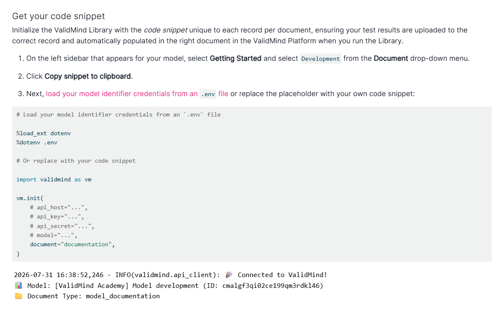

::: {.hidden}
I transformed ValidMind's rudimentary training resources into a comprehensive learning academy to empower users to maximize their use of the product.
:::

Along with authoring the bulk of ValidMind’s user guidance content, I also transformed our rudimentary training resources into a comprehensive learning academy to empower users to maximize their use of ValidMind.



## Situation


::: {.panel-tabset}

### Curriculums

The initial versions of the training lived in the cluttered Quickstart landing,^[[ValidMind Quickstarts](/samples/content-engineering/validmind/quickstarts.qmd)] and contained draft modules that did not cover enough fundamental functionality of ValidMind relevant to each role, or effectively guide users through thoughtful and curated learning journeys.

As with the old quickstart experience, most of the training was focused on the developer role, with very sparse material for the validator and administrator roles. 


### Jupyter Notebooks

Only a poorly laid-out developer demonstration notebook existed, and an executed (with code run outputs) version of the notebook was initially generated via a very manual workflow.

A writer would make a copy of the notebook every time it was updated, freshly run the code, remove any identifying API keys, then upload the notebook with output artifacts to replace the older version displayed within the developer training module.

:::


## Solution

::: {.panel-tabset}

### Curriculums

After designing and implementing a discrete training portal that still connected to the rest of the documentation site branding to signify a shift in content and medium, I extended the curriculums for each role to ensure that users were properly equipped to understand the fundamentals of ValidMind and show value in the product through interactive demonstrations.

Each training course was now broken out into four guided modules built on Reveal.js,^[**Quarto:** [Revealjs](https://quarto.org/docs/presentations/revealjs/){target="_blank"}] with the product embedded live in iframes, supported by a custom pop-up overlay^[** validbeck/slideover:** [Extension Archive](https://github.com/validbeck/slideover/tree/main){target="_blank"}] and styled consistently with the training portal's theme.

Each role was now onboarded onto ValidMind through a journey where subsequent module built on the knowledge gained in the previous modules, culminating in final module that wrapped up the series with either a complete sample project or a fully configured instance of ValidMind's frontend application.

::: {.callout}
The instructions in the new training curriculums are also singled-sourced,^[[Portfolio Framework](/samples/content-engineering/personal/portfolio/framework.qmd#content)] meaning that information for the same task is consistent across the documentation when it is displayed in multiple places, such as in the quickstarts or the full user guides for that feature.

:::


### Jupyter Notebooks

Along with producing a edited version of the developer demonstration notebook, now delivered clean and clear in a four-part series that aligned with each module of the developer training curriculum, I also authored a brand new series of validation demonstration notebooks for the validator role, aligned with each module of the validator training curriculum.

Instead of a writer having to manually execute (run code cells) the notebooks each time they were updated, and uploading the version with execution artifacts to embed into the training, now a GitHub composite action^[** GitHub:** [Creating a composite action](https://docs.github.com/en/actions/tutorials/create-actions/create-a-composite-action){target="_blank"}] chained to our production deployment workflow executed the notebooks on the fly, thanks to Quarto's native JupyterLab support:^[**Quarto:** [JupyterLab](https://quarto.org/docs/tools/jupyter-lab.html#cell-execution){target="_blank"}] 

- [x] No human input required, as the GitHub composite action is triggered by a production deployment.
- [x] No exposed credentials, as any API keys are referenced as repository secrets from the GitHub Workflow:

::: {.tc}
{.pics width="90%"}
:::

#### Production Deployment Workflow

A GitHub Workflow that runs when we deploy to production creates our required API credentials in `.env` files on the fly, then passes these credentials to the notebook execution action:

```yaml
      - name: Create dev.env file
        id: create_dev_env
        run: |
          touch dev.env
          echo VM_API_HOST=${{ secrets.PLATFORM_API_HOST }} >> dev.env
          echo VM_API_KEY=${{ secrets.PLATFORM_API_KEY }} >> dev.env
          echo VM_API_SECRET=${{ secrets.PLATFORM_API_SECRET }} >> dev.env
          echo VM_API_MODEL=${{ secrets.PLATFORM_DEV_MODEL }} >> dev.env

      - name: Create valid.env file
        id: create_valid_env
        run: |
          touch valid.env
          echo VM_API_HOST=${{ secrets.PLATFORM_API_HOST }} >> valid.env
          echo VM_API_KEY=${{ secrets.PLATFORM_API_KEY }} >> valid.env
          echo VM_API_SECRET=${{ secrets.PLATFORM_API_SECRET }} >> valid.env
          echo VM_API_MODEL=${{ secrets.PLATFORM_VALID_MODEL }} >> valid.env

      # Only execute the production notebooks for training if .env files are created
      - name: Execute production ValidMind for development and validation series
        if: ${{ steps.create_dev_env.outcome == 'success' && steps.create_valid_env.outcome == 'success' }}
        uses: ./.github/actions/prod-notebook
        id: execute-prod-notebook
        with:
          dev_env: dev.env
          valid_env: valid.env
```

#### Notebook Execution Action

The notebook execution action renders our notebooks with the production Quarto profile, where execution rules are set:

```yaml
    - name: Ensure dev.env file is available
      shell: bash
      id: find_dev_env
      run: |
        if [ ! -f "${{ inputs.dev_env }}" ]; then
          echo "Error: dev.env file not found at ${{ inputs.dev_env }}"
          exit 1
        fi

    - name: Execute ONLY the ValidMind for development series with heap production
      shell: bash
      if: ${{ steps.find_dev_env.outcome == 'success' }}
      run: |
          cd site
          cp ../${{ inputs.dev_env }} ../.env
          source ../.env
          quarto render --profile exe-prod notebooks/EXECUTED/development &> render_errors.log || {
            echo "Execute for ValidMind for development series failed";
            cat render_errors.log;
            exit 1;
          }

    - name: Ensure valid.env file is available
      shell: bash
      id: find_valid_env
      run: |
        if [ ! -f "${{ inputs.valid_env }}" ]; then
          echo "Error: valid.env file not found at ${{ inputs.valid_env }}"
          exit 1
        fi

    - name: Execute ONLY the ValidMind for validation series with heap production
      shell: bash
      if: ${{ steps.find_valid_env.outcome == 'success' }}
      run: |
          cd site
          cp ../${{ inputs.valid_env }} ../.env
          source ../.env
          quarto render --profile exe-prod notebooks/EXECUTED/validation &> render_errors.log || {
            echo "Execute for ValidMind for validation series failed";
            cat render_errors.log;
            exit 1;
          }
```

#### Production Deployment Profile

```yaml
format:
  html:
    page-layout: full # Extend the page layout to the wider version
    navbar: false # Remove the top navigation for less clutter 
    repo-actions: false # Remove the GitHub actions from the table of contents
    include-in-header: 
      - environments/datadog-production.html # Add Datadog logging for production
execute: 
  enabled: true # "Execute" our notebooks with Quarto's native JupyterLab support
  freeze: auto # Only rerender the notebook if the source notebook has changed
```

:::

::: {.column-margin}
:::{#validmind-jupyter}
:::

:::

## Comparisons

### Training Portal

::: {.panel-tabset}

#### Before

wip

::: {.iframe url="https://validbeck.github.io/training-archive/training/training-overview.html" title="Previous ValidMind Training Portal"}
:::

#### After

designed and implemented this

::: {.iframe url="https://validbeck.github.io/docs/training/training.html" title="New ValidMind Training Portal"}
:::

:::

### Developer Training

::: {.panel-tabset}

#### Before

wip

::: {.iframe url="https://validbeck.github.io/training-archive/training/training-for-model-developers.html#/in-this-training-module" title="Previous ValidMind Developer Training"}
:::

#### After

wip

::: {.iframe url="https://validbeck.github.io/docs/training/developer-fundamentals/developer-fundamentals-register.html" title="New ValidMind Developer Training"}
:::

:::

### Developer Notebooks

::: {.panel-tabset}

#### Before

wip

::: {.iframe url="https://validbeck.github.io/training-archive/notebooks/tutorials/intro_for_model_developers_EXECUTED.html" title="Previous ValidMind Developer Notebook"}
:::

#### After

extended modules, series footnote

::: {.iframe url="https://validbeck.github.io/docs/notebooks/EXECUTED/development/1-set_up_validmind.html" title="New ValidMind Developer Notebooks"}
:::

:::

### Validator Training

::: {.panel-tabset}

#### Before

wip

::: {.iframe url="https://validbeck.github.io/training-archive/training/training-for-model-validators.html#/in-this-training-module" title="Previous ValidMind Validator Training"}
:::

#### After

extended modules, notebooks footnote/listing

::: {.iframe url="https://validbeck.github.io/docs/training/validator-fundamentals/validator-fundamentals-register.html" title="New ValidMind Validator Training"}
:::

::: {.callout}
Along with producing a edited version of the developer demonstration notebook, now delivered clean and clear in a four-part series that aligned with each module of the developer training curriculum, I also authored a brand new series of validation demonstration notebooks for the validator role, aligned with each module of the validator training curriculum.

:::

:::

### Administrator Training

::: {.panel-tabset}

#### Before

wip

::: {.iframe url="https://validbeck.github.io/training-archive/training/training-for-administrators.html#/in-this-training-module" title="Previous ValidMind Administrator Training"}
:::

#### After

extended modules

::: {.iframe url="https://validbeck.github.io/docs/training/administrator-fundamentals/administrator-fundamentals-register.html" title="New ValidMind Administrator Training"}
:::

:::

## Citation

[ archive of `validmind/documentation` by Beck](https://github.com/validbeck/validmind-docs/tree/main/site/training){target="_blank" .button}

::: {.callout}
You can learn more about my involvement with ValidMind's documentation and the impact I had on training and onboarding collateral under [Technical Writing](/samples/technical-writing/validmind/index.qmd#validmind-training).
:::

