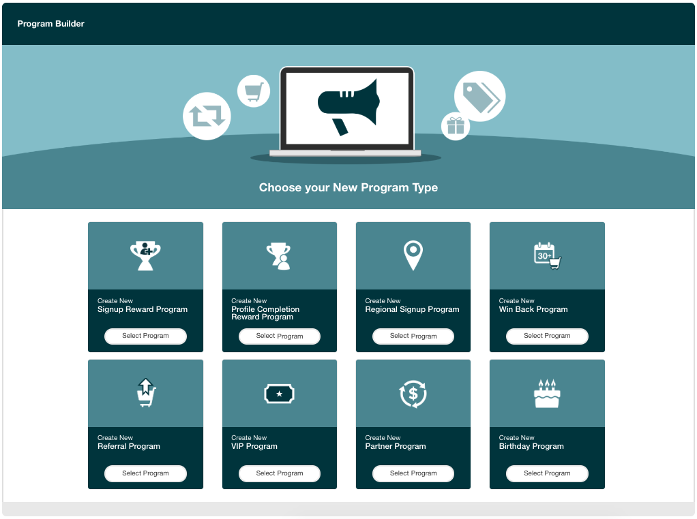

> I owned this feature hightlight post from start to finish.

**How the SaaSquatch approach to Growth Automation extends the frontiers of marketing.**

This guide provides an outline of how the SaaSquatch Growth Automation Platform enables you to leverage the fundamental values of Growth Automation to grow your Customer Lifetime Value.

Consisting of three parts, this guide includes all the resources you need to use our Growth Automation platform and skyrocket the success of your business.

## Growth Automation and Referral Marketing

:::: {.flex .flex-wrap .justify-around}

::: {.w-70-ns}

As a business, customer lifetime value is no doubt among your top goals. SaaSquatch helps you achieve these goals by recognizing the importance of interacting with your users on an individual level and providing consistent but ever-evolving programs that entice customers to remain with you over a lifetime.

Referral marketing has long been a foundational piece in user engagement and lead generation, but not all customer programs are created equal.

Our Growth Automation platform will allow you to grow those leads into dynamic and individualized relationships with your customer base.

:::

::: {.w-30-ns .tc .flex .items-center .justify-center}

{.pics}

:::

::::

Our Growth Automation platform provides a single, affordable solution for marketers to engage with their customers directly and with more relevance than previously possible in an innovative streamlined flow.

With all new program types such as First Purchase, Signup Reward, Profile Completion Reward, Days Since Last Purchase, Regional Signup, Birthday Program, and more, including any custom events of your choice, you're able to configure as many reward programs as there are unique milestones in your customer lifecycle.

To learn more about how Growth Automation can maximize usage of modern marketing techniques, click here to see our GA-101 primer.

## Unlimited Flexibility

Your business is extremely varied in what it offers to customers, so we've built our Growth Automation platform to be extremely flexible and capable of supporting a wide range of possibilities with regards to when you can reward users.

If none of the above offered turnkey programs suit your needs, we can help you design a custom program that rewards your customers on a milestone of your choice. By using our infinitely adaptable API library, you'll be able to send us varied information about your customers' activity within your business — as much or as little as you want — information that is processed by our system in a way that automatically signals when a user should receive a reward.

We call this information custom events, and they can be anything you like — from account information updates to an abritrary action performed by your users within your system. Once a user hits the required amount, or type of event, that will have already been passed through to SaaSquatch upon completion, they will be immediately rewarded without requiring any further action.

These events are entirely adjustable; you can ask our system to reward on a specific accumulation of a type of event or on receipt of a specific type of event. You can even pass additional events for use in future Growth Automation programs you may want to run based on user account history.

## The Loyalty Lexicon

Growth Automation is about more than just referrals — it's about learning the language of your users. While our usual core topics might still be in play depending on the configuration of your program, Growth Automation focuses on the customer, not the process. What does this mean, exactly? Let's take an in-depth look at one of our template programs: Win Back Program.

The premise of this program is simple; we want to: re-engage past customers; reduce customer churn; increase customer spending frequency; and promote new services. There's no referral widget, no share-links or codes involved, just settings you enter once (and adjust at your leisure) to indicate when a user should receive a reward.

As you will have been passing user information to SaaSquatch from the beginning, no additional information is required from you. But what about encouraging new customers to sign up and start engaging with your product, so you can first learn more about their ongoing needs?

Our Profile Completion Reward Program encourages your users to fully integrate themselves with your product or interface after initial signup, providing you an easy and unobtrusive way to collect data to use for any programs you might want to run going forward.

You're able to request any fields you want to be mandatory, as well the ability to create any number of custom fields that might not already be provided by us. With just the check of a box, you can reward customers for simply sharing details they may already be entering anyway — it's a win-win.

## Additional Resources

The Growth Automation 101 article provides the basics of what Growth Automation offers.

::: {.callout}
The next part of this guide outlines the core components that are unique to a Growth Automation program. Familiarizing yourself with these pieces will allow you to build an extremely flexible custom program.
:::

More about how your users will interact with your Growth Automation program can be found in our Growth Automation Customer Lifecycle article.

#### Citation

[SaaSquatch Help Center: View original post](https://docs.saasquatch.com/growth/saasquatch-ga){.button}