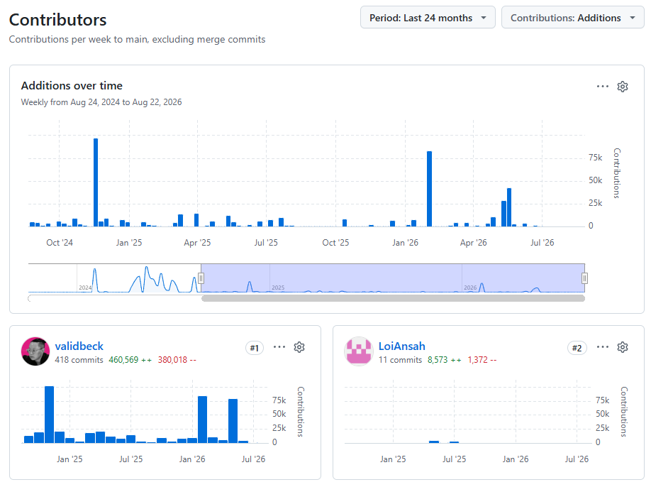

Tutorials, user guides, training, developer content and more, oh my!

## ValidMind



As I authored the bulk of 53% of user content out of many contributors,^[{.pics}  Citation: [ `validmind/documentation` statistic archive](https://github.com/validbeck/validmind-docs/graphs/contributors?from=8%2F24%2F2024&selectedMetric=additions){target="_blank"}] most of ValidMind's documentation saw my influence at some point. I've selected some of my best work to showcase below: 

:::{#validmind-technical}
:::

### Atryum





:::{#atryum-technical}
:::

<!-- ::: {.callout}
You can learn more about my involvement with ValidMind, Atryum, and the impact I had on content and content architecture under [Content Engineering](/samples/content-engineering/index.qmd)
::: -->

## SaaSquatch





:::{#saasquatch-technical}
:::

