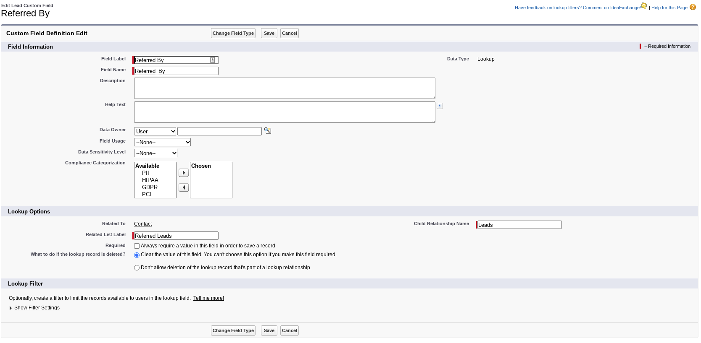
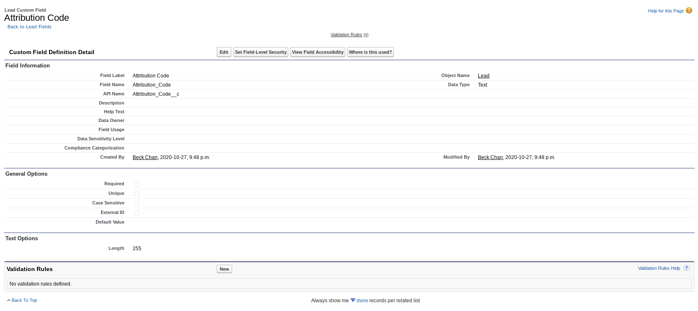
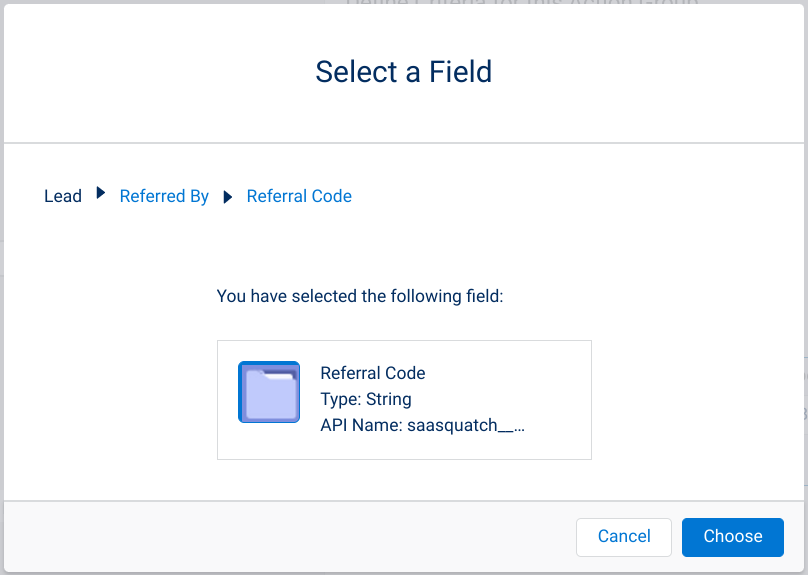
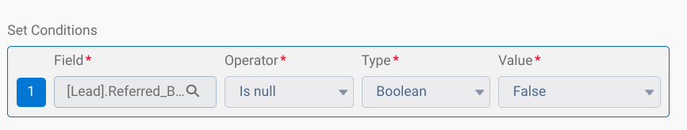
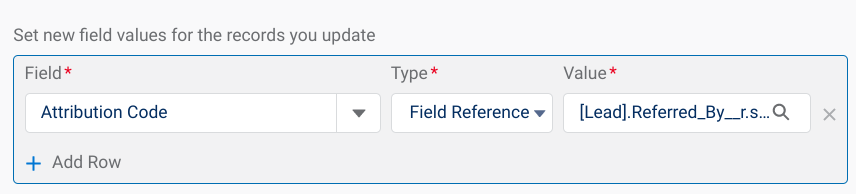
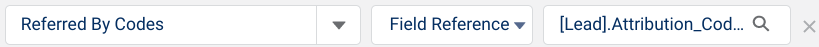

> I owned this entire guide from start to finish. 
>
> For this endeavour, I researched and familiarized myself with the following Salesforce features:
>
> - [Salesforce: Page Layouts](https://help.salesforce.com/s/articleView?id=platform.customize_layout.htm&type=5){target="_blank"}
> - [Salesforce: Create a Custom Field](https://help.salesforce.com/s/articleView?id=platform.adding_fields.htm&type=5){target="_blank"}
> - [Salesforce: Map Custom Lead Fields ...](https://help.salesforce.com/s/articleView?id=sales.customize_mapleads.htm&type=5){target="_blank"}
>
> Any links to guides I did not author have been removed for this archived version.

When properly synced, the SaaSquatch SFDC can be configured to automatically retrieve a Referrer's (Contact) "Referral Code" and apply it to a Custom Field on the Referred User (Lead).

::: {.callout}
**Note:** This page details a feature that is no longer available for archival purposes as Salesforce has sunset the Process Builder feature. Please use Workflows or Apex code to build your program instead.
:::

## Introduction
This guide provides instruction on how to make use of a Lookup Custom Field to populate a Text Custom Field with the Referrer's "Referral Code" on the Lead record, which can then be sent to SaaSquatch to attribute the Lead to the Contact (creating a referral).

## Before You Start

1. Make sure that you've installed the SaaSquatch SFDC integration into your Salesforce instance, including adding the "Referral Code" field to the Contact Page Layout.

2. Make sure you have administrative access and know how to work with:
    - Page Layouts
    - Custom Fields
    - Processes within Process Builder

3. The below guide also assumes that:
    - Your new Referred Users are being created as Leads,
    - You intend to create/update a user in SaaSquatch when a Lead is created/updated in SFDC.

## 1. Creating the Contact Lookup Field
Create a new Custom Field on the Lead:

- Make sure to select a Data Type of "Lookup Relationship"
- Select "Contact" for your related object
- Name your field something like "Referred By"
- Name the Child Relationship Name something like "Leads"
- Name the related list something like "Referred Leads"
- SFDC Contact Lookup Field

::: {.tc}
{.pics width="80%"}
:::

::: {.callout}
Make sure to make the field available to the required users as well as adding it to the Lead Page Layout. We recommend editing the Page Layout to include your Custom Field in the "SaaSquatch" section.

:::

## 2. Creating the `ReferredByCodes` Custom Field
Create a new Custom Field on the Lead:

- Make sure to select a Data Type of "Text"
- Enter a max length (*e.g*. `255`)
- Name your field something like "Attribution Code" or "Referred By Code"

::: {.tc}
{.pics width="80%"}
:::

::: {.callout}
Make sure to make the field available to the required users as well as adding it to the Lead Page Layout. We recommend editing the Page Layout to include your Custom Field in the "SaaSquatch" section.

:::

## 3. Automatically Populating the Referral Code When a Contact is Selected via Lookup
Once you've set up a Lookup field to search for Contacts, and a Text field to hold the Referrer's "Referral Code", you can [build a Process](invocable-methods.qmd) to grab the "Referral Code" from the Contact record and place it onto the custom field on the Lead.

1. Create a New Process. Give it a name and description that reflects the outcome of the Process, such as "Apply Referral Code from Contact".

2. For 'The process starts when', select "A record changes".

3. Add an Object, and select 'Lead' as your Object. We recommend allowing the Process to start "when a record is created or edited", so that both creation and update of users can occur.

4. Add your Criteria. We recommend setting a Condition that the Process will only run if the "Referral Code" field on the Contact that was looked up exists (*i.e*. `Is null: False`): SFDC Contact Referral Code SFDC Referral Code Exists

::: {.tc}
{.pics width="80%"}
  
{.pics width="80%"}
:::

5. Add your Actions:
    - Select 'Update Records' under "Action Type", and give your action a name that reflects the outcome (*e.g*. Apply Referral Code)
    - Choose 'Select the Lead record that started your process' under your "Record Type".
    - Set the field value for the Lead you want to update. Select the Text Custom Field you created previously (*e.g*. Attribution Code) and select the Contact's Referral Code as the Value via a Field Reference Type: 
    
::: {.tc}
{.pics width="80%"}
:::

6. Once your Process is completed and Saved, make sure to Activate it so it can run.

::: {.callout}
You can also set this up using Workflow Rules or through APEX if those methods are more accessible for you.
:::

## 4. Sending the `ReferredByCodes` Information to SaaSquatch
Once the your `ReferredByCodes` Custom Field is populated, you can send that information to SaaSquatch via an upsert.

When defining your Apex Variables in your Process, select the Field "Referred By Codes" and then reference the Custom Field you've created and configured to autopopulate with the Referrer's "Referral Code":

::: {.tc}
{.pics width="80%"}
:::

::: {.callout}
You can also make an upsert via APEX if this is easier for you.
:::

#### Citation

[SaaSquatch Help Center: View Original Guide](https://docs.saasquatch.com/salesforce/attribution-lookup/){.button}