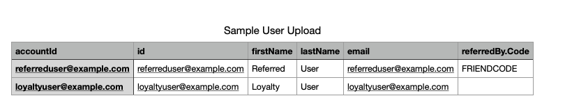
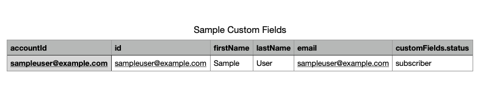

> I owned this entire guide from start to finish. 
>
> This step-by-step guide was meant to offer a low-impact alterative program install method to customers who were not able to acquire development team resources.
> 
> Any links to guides I did not author have been removed for this archived version below.

This guide outlines how to upload users and trigger Program Goals by only using our Bulk Import processes.

## Adding users
You can use the **Bulk User Import** to upload both Referrers and Referred Users, or Loyalty users.

- All you will need to include at minimum is `accountId` and `id`, but we recommend also including the user's first and last names as well as email.
- To connect up a referral, the referrer's code (`FRIENDCODE` in the example file below) will need to be provided in a `referredBy.Code` column.

::: {.callout}
Supply both an account ID (`accountId`) and a user ID (`id`) field for the users being imported. Unless you are using our Shared Accounts feature, both the account and user ID fields should be the same value and ideally match your internal user IDs.

You can include any other additional information about the user by using the fields outlined on our Bulk User Import page.

:::

### Example user import

::: {.tc}
{width="90%" .pics}
:::

- Row 1 "Referred User" will be referred to an existing user whose referral code is `FRIENDCODE`.
- Row 2 "Loyalty User" will not be referred to any existing users, and simply be created or updated.

### Importing the User File

::: {.callout}
Once the file has been filled with all relevant user information, export it as a .csv file and proceed with importing the file.

:::

## Triggering program goals
Your program should be set up with **Program Goals** that trigger on either:

- User events
- User custom fields

::: {.callout}
You'll need to identify the event or custom field that triggers your goal and apply that logic to the below instructions.
:::

### User event trigger
For goals that trigger when a user performs an action, **you'll need to build a Bulk Event Import**.

### User custom field trigger
You can use the same Bulk User Import to send along the custom field. In the below example, the program goal is met when the custom field `status` is `subscriber`.

::: {.tc}
{width="90%" .pics}
:::

::: {.callout}
You're able to send this custom field along with the user creation in order to trigger the goal if the user has already met the conditions.
:::

#### Citation

[SaaSquatch Help Center: View Original Guide](https://docs.saasquatch.com/csv-programs){.button}