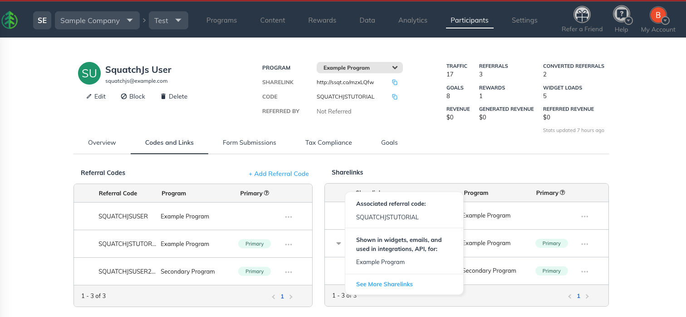

> I owned this entire guide from start to finish. 
>
> For this endeavour I drew upon my knowledge of:
>
> - [REST APIs](https://www.ibm.com/think/topics/rest-apis){target="_blank"}
> - [GraphQL API](https://graphql.org/){target="_blank"}
> - [JSON Objects](https://www.w3schools.com/js/js_json_datatypes.asp){target="_blank"}
>
> Any links to guides I did not author have been removed for this archived version below.


Learn about the different types of sharelinks that are available for each of your referral program's participants, and how they can be utilized to drive extremely detailed and accurate analytics data.

By default, each user in your SaaSquatch referral programs have a series of links assigned to them designed to:

1. Direct Referred Users who click on the link to your referral program Landing Page for a specific program.
2. Let the SaaSquatch system add the correct [cookie](/samples/technical-writing/saasquatch/sdk/tracking-cookies.qmd) to the Referred User's browser to help attribute the referral back to the correct Referrer for that program.
3. Track the Engagement and Share mediums used by the Referrer.

::: {.callout}
- The Engagement medium is the method you use to show a user's share information to them.
- The Share medium is the method used by the Referrer to distribute their share information to their Referred Users.
:::

## The sharelink object

::: {.callout}
Sharelinks are contained in an object that groups the links by Engagement medium.
:::

Making the correct sharelink available in the right place in your referral program will mean that your program's analytics are able to provide a more detailed breakdown of where Referrers and Referred Users are interacting with your referral program.

This information can be used to help understand and optimize your programs.

### Retrieving the sharelink object
A few methods can be used to retrieve a user's sharelinks:

- Via the SaaSquatch administrative portal, on the participant's Codes and Links tab (see image below).
- Via the REST API, by using either the Lookup a user or Lookup a user's share URLs calls.
- Via the GraphQL API, using the user.shareLinks query.

::: {.tc}
{width="90%" .pics}
:::


### Sharelink object example

::: {.callout}
You can see that the example below groups the sharelinks by Engagement medium and provides a full array of share medium links for each engagement type.
:::

| Engagement Medium	| Details |
|--|--|
| POPUP	| Shown to users via a `PopupWidget`. | 
| EMBED	| Shown to users via an `EmbedWidget`.| 
| HOSTED	| Shown to users via a "Hosted" Widget.| 
| cleanShareLink	| Shown on the user's participant profile in the SaaSquatch administrative portal.| 
| UNKNOWN	| Set of sharelinks retrieved for a user via a User Details Report.| 
| EMAIL	| Shown to users via program notification emails. | 
| MOBILE	| Shown to users via the mobile SDKs.| 
: {tbl-colwidths="[25,75]"}

```json
{
  "POPUP": {
    "FACEBOOK": "http://ssqt.co/m9xLQfw",
    "TWITTER": "http://ssqt.co/mMxLQfw",
    "EMAIL": "http://ssqt.co/moxLQfw",
    "DIRECT": "http://ssqt.co/m5xLQfw",
    "LINKEDIN": "http://ssqt.co/m7xLQfw",
    "SMS": "http://ssqt.co/maxLQfw",
    "FBMESSENGER": "http://ssqt.co/mhxLQfw",
    "WHATSAPP": "http://ssqt.co/mFxLQfw",
    "LINEMESSENGER": "http://ssqt.co/mDxLQfw",
    "PINTEREST": "http://ssqt.co/RzxLQfw",
    "UNKNOWN": "http://ssqt.co/mBxLQfw"
  },
  "EMBED": {
    "FACEBOOK": "http://ssqt.co/mwxLQfw",
    "TWITTER": "http://ssqt.co/mcxLQfw",
    "EMAIL": "http://ssqt.co/mJxLQfw",
    "DIRECT": "http://ssqt.co/mQxLQfw",
    "LINKEDIN": "http://ssqt.co/mHxLQfw",
    "SMS": "http://ssqt.co/m2xLQfw",
    "FBMESSENGER": "http://ssqt.co/mgxLQfw",
    "WHATSAPP": "http://ssqt.co/mZxLQfw",
    "LINEMESSENGER": "http://ssqt.co/mxxLQfw",
    "PINTEREST": "http://ssqt.co/mfxLQfw",
    "UNKNOWN": "http://ssqt.co/mXxLQfw"
  },
  "HOSTED": {
    "FACEBOOK": "http://ssqt.co/muxLQfw",
    "TWITTER": "http://ssqt.co/mSxLQfw",
    "EMAIL": "http://ssqt.co/mlxLQfw",
    "DIRECT": "http://ssqt.co/mtxLQfw",
    "LINKEDIN": "http://ssqt.co/mYxLQfw",
    "SMS": "http://ssqt.co/mqxLQfw",
    "FBMESSENGER": "http://ssqt.co/mKxLQfw",
    "WHATSAPP": "http://ssqt.co/mrxLQfw",
    "LINEMESSENGER": "http://ssqt.co/mWxLQfw",
    "PINTEREST": "http://ssqt.co/RmxLQfw",
    "UNKNOWN": "http://ssqt.co/mAxLQfw"
  },
  "cleanShareLink": "http://ssqt.co/mzxLQfw",
  "UNKNOWN": {
    "FACEBOOK": "http://ssqt.co/mmxLQfw",
    "TWITTER": "http://ssqt.co/mRxLQfw",
    "EMAIL": "http://ssqt.co/mLxLQfw",
    "DIRECT": "http://ssqt.co/mvxLQfw",
    "LINKEDIN": "http://ssqt.co/m6xLQfw",
    "SMS": "http://ssqt.co/mkxLQfw",
    "FBMESSENGER": "http://ssqt.co/m0xLQfw",
    "WHATSAPP": "http://ssqt.co/mIxLQfw",
    "LINEMESSENGER": "http://ssqt.co/m8xLQfw",
    "PINTEREST": "http://ssqt.co/mpxLQfw",
    "UNKNOWN": "http://ssqt.co/mzxLQfw"
  },
  "EMAIL": {
    "FACEBOOK": "http://ssqt.co/mTxLQfw",
    "TWITTER": "http://ssqt.co/mGxLQfw",
    "EMAIL": "http://ssqt.co/mbxLQfw",
    "DIRECT": "http://ssqt.co/mPxLQfw",
    "LINKEDIN": "http://ssqt.co/m1xLQfw",
    "SMS": "http://ssqt.co/mOxLQfw",
    "FBMESSENGER": "http://ssqt.co/m4xLQfw",
    "WHATSAPP": "http://ssqt.co/mixLQfw",
    "LINEMESSENGER": "http://ssqt.co/myxLQfw",
    "PINTEREST": "http://ssqt.co/RLxLQfw",
    "UNKNOWN": "http://ssqt.co/mVxLQfw"
  },
  "MOBILE": {
    "FACEBOOK": "http://ssqt.co/mnxLQfw",
    "TWITTER": "http://ssqt.co/mCxLQfw",
    "EMAIL": "http://ssqt.co/mExLQfw",
    "DIRECT": "http://ssqt.co/mexLQfw",
    "LINKEDIN": "http://ssqt.co/m3xLQfw",
    "SMS": "http://ssqt.co/mNxLQfw",
    "FBMESSENGER": "http://ssqt.co/mUxLQfw",
    "WHATSAPP": "http://ssqt.co/msxLQfw",
    "LINEMESSENGER": "http://ssqt.co/mdxLQfw",
    "PINTEREST": "http://ssqt.co/RRxLQfw",
    "UNKNOWN": "http://ssqt.co/mjxLQfw"
  }
```

#### Citation

[SaaSquatch Help Center: View Original Guide](https://docs.saasquatch.com/developer/sharelinks/){.button}